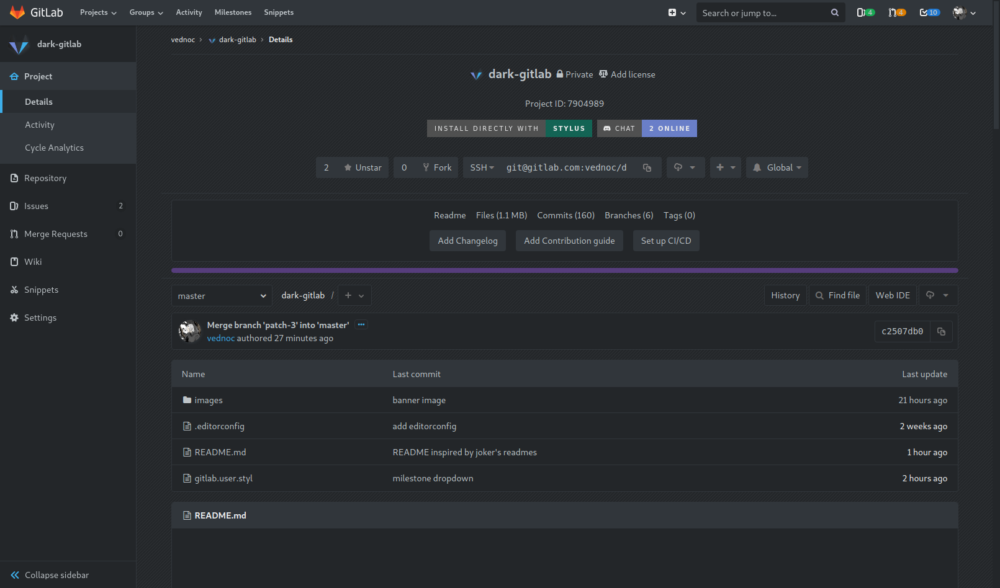
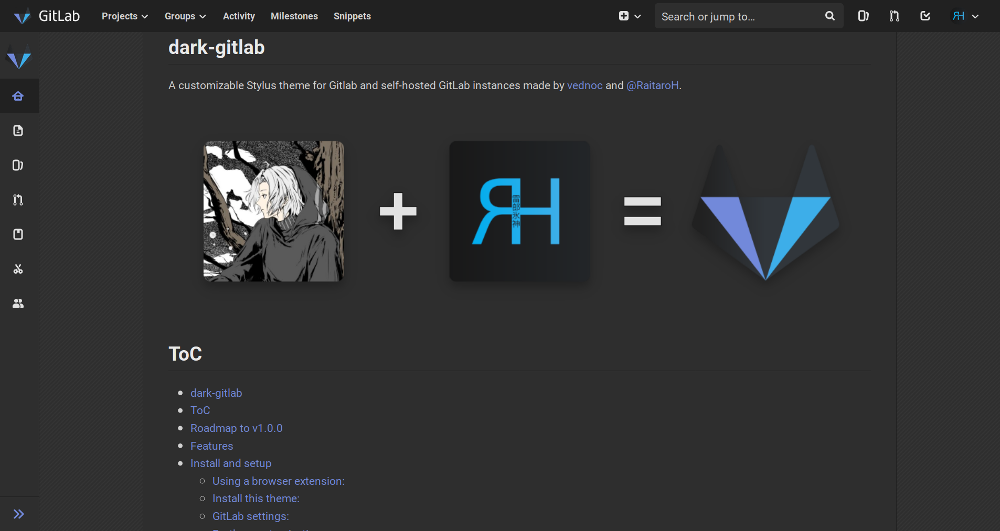
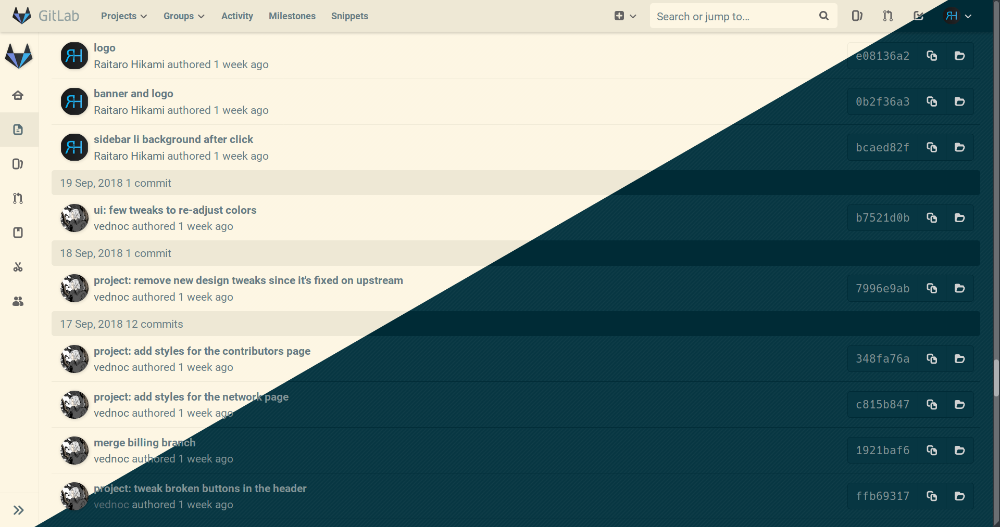
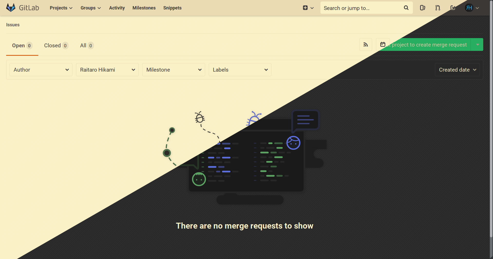

# dark-gitlab

A customizable Stylus theme for Gitlab and self-hosted GitLab instances made by [vednoc](https://gitlab.com/vednoc) and [@RaitaroH](https://gitlab.com/RaitaroH). 

  

# ToC
- [dark-gitlab](#dark-gitlab)
- [ToC](#toc)
- [Roadmap to v1.0.0](#roadmap-to-v100)
- [Features](#features)
- [Install and setup](#install-and-setup)
    - [Using a browser extension:](#using-a-browser-extension)
    - [Install this theme:](#install-this-theme)
    - [GitLab settings:](#gitlab-settings)
    - [Further customization:](#further-customization)
- [Screenshots](#screenshots)
- [Contributing](#contributing)

# Roadmap to v1.0.0

* [X] Make a better logo.
* [X] Add a banner.
* [ ] Add a license.
* [ ] Add a contribution guide.
* [ ] Add a changelog.
* [x] Write a concise readme.
* [ ] Add issue and merge request templates.
* [x] Convert to [Stylus-lang](https://stylus-lang.org):
  * [x] Make a use of vars, mixins, nesting, etc.
  * [ ] Refactor existing CSS.
  * [ ] Full coverage.
* [x] Convert to [BetterComments](https://github.com/aaron-bond/better-comments):
  * [ ] Full coverage.
* [x] Cover most of the GitLab website.
* [x] Have a *decent* compatability with a few older versions for self-hosted instances. Might get dropped depending on the number of breaking changes.
* [ ] Add a version with USo preprocessor so xStyle and extensions that support UserCSS can install this theme.
  * [ ] Automate the process; not a high priority.

# Features

* **Customizable colors**: Both light and dark color-schemes are fully supported; you can use built-in color picker to customize colors and/or use my [ThemeSwitcher](https://gitlab.com/vednoc/theme_switcher) to choose from already available presets. Tip: Use both, one for light and the other for dark color-scheme.
* **Customizable background**: Whether you like the default background or you want a custom image, color or nothing at all, you're able to do whatever you want from within the popup.
* **Custom regexp**: Support for public self-hosted GitLab instances. You can easily add your own by editing the `@-moz-document regexp(...)` locally (**Note**: that prevents the auto-update feature, unfortunately, but you can always force an update).
* **Custom code font**: Use your favorite font for code sections, i.e. FiraCode, Operator Mono, Iosevka, etc.
* **Custom rounded corners value**: Set your prefered border-radius for main elements (excluding buttons); not available everywhere atm.
* **Old-design project header**: If you prefer to have the elements in the center, now you can have it back.
* **Complete theme**: for the entire UI; still very much WIP and it'll only get better with time.
* Anything else you'd like to have? Feel free to make a suggestion.

# Install and setup

### Using a browser extension:
* Stylus - get the addon for [Firefox](https://addons.mozilla.org/en-US/firefox/addon/styl-us/), [Chrome](https://chrome.google.com/webstore/detail/stylus/clngdbkpkpeebahjckkjfobafhncgmne) and [Opera](https://addons.opera.com/en-gb/extensions/details/stylus/).

### Install this theme:  

  >Installs directly from this repository.  
  >This is only available using Stylus (see the [documentation](https://github.com/openstyles/stylus/wiki/Usercss)). :tada:  
  >**NOTE:** The theme is also available on [userstyles.org](https://userstyles.org/styles/164877) only so we can attract more users. It's updated manually every so often and has only basic custom settings; we highly encourage you to install the theme from this repository and not from USo in any given circumstance.

### GitLab settings:
The theme works best with the default settings and it's not extensively tested with GitLab's default presets. Go to settings -> preferences and select indigo for the navigation theme and white for the syntax highlighting.

### Further customization:
Open the Stylus extension popup while you're on any GitLab page, click on the cogwheel icon and that'll open up a menu from which you can set your own preferences.

**NOTE:** To use "maximum width for fluid layout" go to settings -> preferences and change the layout from fixed to fluid.

# Screenshots

Project page view with BreezeDark color-scheme from [ThemeSwitcher](https://gitlab.com/vednoc/theme_switcher), max-width of 1300px and old project header design enabled.

Default theme, without ThemeSwitcher:

Solarized light/dark:

Gruvbox light/dark:

# Contributing

Any contribution is greatly appreciated. If you really like the project and would like to tip me then you can buy me a coffee over at [ko-fi](https://ko-fi.com/vednoc).

- [Back to top.](#dark-gitlab)
